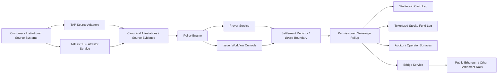
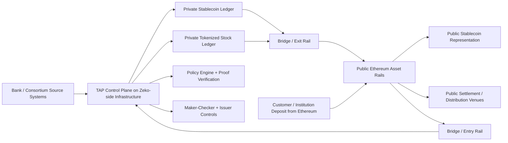
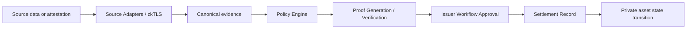
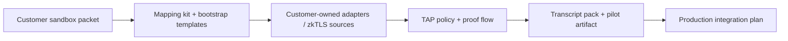

# Private Tokenized Asset Protocols Are Finally Practical

## Building TAP: a private, permissioned, sovereign-rollup control plane for stablecoins and tokenized stocks

Public-chain tokenization got one thing very right: it proved there is demand for programmable digital representations of real assets.

It also locked the industry into a narrow operating model:

- issuance on a fully public chain
- compliance gates bolted on at the edges
- sensitive business logic off-chain and opaque
- customer and institutional activity exposed by default
- fragmented issuer ecosystems with limited defensibility

That model is good enough for first-generation tokenization.

It is not good enough for where the market is going.

Banks, brokers, custodians, transfer agents, consortium operators, and regulated issuers do not want to live on a public spreadsheet. They need private state, controlled participation, auditable policy enforcement, and the ability to keep ecosystem value inside infrastructure they govern. They also need a path back to public liquidity and settlement rails when that is useful.

That is the design space behind TAP: the Tokenized Asset Protocol.

TAP is a self-hostable control plane for private asset tokenization workflows. It is designed for permissioned, sovereign rollup environments that can settle privately most of the time, while still bridging to public chains like Ethereum when needed.

The key idea is simple:

- stablecoins are the cash leg
- tokenized stocks and funds are the risk-asset leg
- identity, balance, holdings, and suitability data stay off-chain
- policy decisions become deterministic and auditable
- proofs and attestations become the bridge between private source systems and private on-chain execution

That combination creates something earlier tokenization systems could not really do: operate a private two-sided market with regulated controls, customer data minimization, consortium governance, and optional public-chain settlement at the edges.

## What we built

Over the course of this build, TAP moved from protocol framing to a working demo and integration toolkit.

Today the repo includes:

- a multi-package TAP backend
- policy versioning and settlement-time policy linkage
- maker-checker issuer workflows
- proof generation and verification lanes
- zkTLS integration paths
- partner API adapter infrastructure
- stablecoin and stock lifecycle flows
- a dual-asset flagship transcript
- a customer-owned sandbox integration kit

The repo is not a single app. It is a full operating surface.

At a high level:

- `apps/api-gateway` is the control plane API
- `packages/policy-engine` manages versioned policy state
- `packages/prover-service` manages proof verification lanes
- `packages/source-adapters` connects external systems
- `packages/attestor-service` handles statement, phone, and zkTLS attestation flows
- `packages/compliance-engine` evaluates policy decisions
- `packages/contracts` is the settlement/zkApp boundary
- `scripts/` contains operator, demo, transcript, and onboarding workflows

We also built the materials needed to make it legible to real counterparties:

- onboarding packets
- pilot proposals
- customer integration templates
- public transcript packs
- flagship runbooks
- provider strategy documentation

That matters because protocol design without operator clarity is just theory.

## The architecture

The architecture is built around a very specific institutional operating model.

Customer data and business state originate in institution-controlled systems:

- bank balance APIs
- KYC systems
- holdings and custody ledgers
- treasury systems
- private HTTPS systems that can be proven through zkTLS

Those sources are not pushed directly on-chain. Instead, they are normalized through TAP’s adapter and attestation surface, then linked into policy and settlement workflows.

### Architecture diagram

### Private rollup operating layer vs public Ethereum rails

This is the split that matters:

- Zeko-side infrastructure is the private operating environment
- Ethereum is the public interoperability and distribution rail
- the bridge is the controlled path between the two

### Control-plane flow from source truth to private state transition

This is the core TAP claim: private tokenized assets should not move because a front end says they can move. They should move because source evidence, policy state, proof verification, and issuer controls all agree that the transition is allowed.

### Customer-owned integration path

That final diagram matters for go-to-market. TAP is not supposed to be a closed hosted product that only works with pre-approved vendors. The public repo proves the architecture. The customer-owned integration path proves how a bank or consortium can bring its own systems and turn the repo into a real pilot.

This is not just a “proof pipeline.”

It is a control plane where:

- source truth stays off-chain
- compliance logic is explicit and versioned
- approval paths are operationally real
- settlement artifacts remain auditable
- private execution remains private

## Why this was not really possible before

There have been earlier pieces of this system in isolation.

You could have:

- public issuance on Ethereum
- permissioned transfer logic in smart contracts
- off-chain compliance reviews
- private databases feeding internal ledgers
- zero-knowledge systems proving isolated facts

What you could not easily do was combine them into one practical operator workflow with the right tradeoffs.

### 1. Public-first tokenization exposed too much

Traditional tokenization on public Ethereum leaks too much institutional information:

- issuance timing
- transfer timing
- asset topology
- address-level clustering
- treasury movement
- ecosystem composition

For regulated financial institutions, that is not a small drawback. It is a structural mismatch.

### 2. Existing compliance gates were mostly edge gates

Most first-wave tokenized assets used a simple pattern:

- run checks off-chain
- gate wallet onboarding
- issue a token publicly
- hope transfer restrictions remain manageable

That is not the same as a policy-linked operating model.

TAP takes the opposite approach:

- source collection is explicit
- policy is versioned
- proof linkage is verified at settlement time
- issuer workflows are operationally constrained

That means the compliance layer is not just “before chain.” It is part of the system’s actual state transition logic.

### 3. Private execution plus public optionality was missing

The interesting future is not “everything is public” or “everything is private.”

It is:

- private rollup execution for institutional ecosystems
- public-chain bridgeability when distribution or interoperability matters

That lets issuers preserve internal network effects while still maintaining optional access to public markets.

### 4. zkTLS and real proof lanes changed the input side

The modern shift is not only about private settlement. It is also about private, verifiable inputs.

TAP now supports multiple ways to bring in high-value facts:

- direct partner API adapters
- generic REST mappings
- real `o1js` proof verification lanes
- external zkTLS-backed attestations

This matters because many institutional facts do not begin life in a blockchain-native system. They begin life in:

- web applications
- internal APIs
- treasury portals
- custody systems
- KYC providers

Once you can verify those sources without publishing the underlying data, private tokenization becomes much more realistic.

## The core design principles

### 1. Provider-agnostic by default

TAP is not a Plaid product, a Persona product, or a custody-vendor product.

We added reference adapters because real systems need proof points. But the architecture is built so a customer can bring:

- a bank sandbox
- a brokerage API
- a custody ledger
- a treasury system
- a zkTLS-compatible HTTPS source

That is why we built:

- onboarding packets
- a provider strategy
- a customer sandbox mapping kit
- customer bootstrap templates
- a customer-owned dual-asset demo pack

The repo is meant to be forked and adapted, not merely configured around one vendor.

### 2. Policy is first-class state

A lot of systems say they are compliance-aware when they really mean:

- “we check a few things before we proceed”

TAP treats policy as durable, versioned, auditable state.

We built:

- versioned policy registry
- deterministic policy hash
- policy linkage in proof public inputs
- settlement-time policy verification
- explicit stale or mismatched policy rejection

That gives regulated operators something much closer to real governance and control evidence.

### 3. Issuer operations are part of the protocol surface

Institutional issuance is not just a technical transaction.

It is an operational process involving:

- roles
- approvals
- exceptions
- auditability

That is why TAP includes maker-checker controls and explicit lifecycle actions for:

- stablecoin mint
- stablecoin burn
- stock issue
- stock allocation
- stock restriction
- stock redemption

This is how tokenization starts to look like actual institutional infrastructure instead of just token deployment.

### 4. Stablecoin and stock are treated as one market system

One of the key decisions in this build was to stop thinking about stablecoins and tokenized securities as separate demos.

They are not separate.

In a private market environment:

- stablecoins are the cash rail
- tokenized stocks, funds, and certificates are the risk assets

If you want to show the future, you need both.

That is why we built:

- a stock lifecycle workflow
- a dual-asset flagship transcript
- a customer-owned dual-asset integration example

The resulting story is much stronger than “here is a stablecoin demo” or “here is a tokenized stock demo.”

It becomes:

- here is a private market stack

## The source side: adapters and zkTLS

One of the most important parts of the project is how source truth enters the system.

### Reference adapters

We implemented and scaffolded adapters across the key categories:

- balance/account state
- identity/KYC
- holdings/custody
- generic REST provider integrations
- bank-style server-to-server APIs

Those are the public proof points.

### zkTLS integration

We also patched in a real zkTLS path using the Zeko `zk-verify-poc` work.

That allowed us to demonstrate:

- external TLS-attested source collection
- bank-shaped fixture data
- proof mapping into TAP settlement records

This is strategically important because many customer environments will not begin with a polished partner API. Some will begin with a secure HTTPS system that needs to be proven, not merely trusted.

### Why both modes matter

The right answer is not “always use adapters” or “always use zkTLS.”

The right answer is:

- use adapters when a customer has a stable API
- use zkTLS when they have a meaningful HTTPS system but no clean integration surface yet

That guidance is now built directly into TAP’s provider strategy and customer onboarding materials.

## The proof side: from mocks to real runtime lanes

A protocol like this only becomes credible when proof verification is real enough to matter operationally.

We moved through that progression.

TAP now includes:

- cryptographic proof envelopes
- real `o1js` runtime lanes for `eligibility_v1`
- real `o1js` runtime lanes for `transfer_compliance_v1`
- pluggable verifier support
- external-proof preservation for zkTLS-backed flows

That means the repo is no longer only a UI or integration mockup. The proof and settlement surfaces are materially real.

## The operator side: transcripts, packs, and release discipline

Another major theme in the build was making the system operable, not just architecturally interesting.

We built one-command flows for:

- stock lifecycle
- dual-asset flagship path
- identity reference path
- holdings reference path
- customer-owned dual-asset integration path

Each of these can generate verified transcripts and public-safe artifacts.

That matters because:

- bank teams need evidence
- internal champions need something shareable
- public repositories need a coherent story

The public pack now has two key roles:

- the flagship transcript explains the product
- the customer-owned dual-asset transcript explains the integration path

That combination is much closer to how enterprise adoption really happens.

## What this enables that earlier tokenization systems did not

### Private consortium issuance

Multiple institutions can participate in one permissioned environment while preserving:

- private balances
- private customer state
- internal routing and governance value

### Verifiable off-chain controls

Instead of pushing raw institutional data on-chain, TAP lets issuers prove or attest:

- balance thresholds
- KYC pass state
- suitability or accreditation
- holdings state
- reserve or treasury conditions

### Shared but sovereign infrastructure

Institutions can operate as a consortium while still retaining control over:

- participant access
- infrastructure surface
- policy lifecycle
- application ecosystem value

### Public-chain interoperability without public-chain dependence

This is the important design shift.

Bridging to Ethereum or another public chain becomes a choice, not the base operating assumption.

That means:

- private markets can stay private
- public distribution can still happen where useful
- the customer does not have to give up all information advantage just to get blockchain programmability

## Where TAP stands now

TAP is already beyond architecture-only status.

The repo now contains:

- a credible private tokenization demo
- a dual-asset product story
- real proof lanes
- reference adapters
- zkTLS integration
- customer onboarding and sandbox mapping infrastructure

The remaining work is not “can this concept be made concrete?”

It is:

- customer-specific integrations
- production hardening
- deployment discipline
- operational rollout

That is exactly the right stage for an open-source evaluation package.

## The bigger thesis

The biggest shift in tokenization is not that more assets will appear on-chain.

It is that serious tokenization will move away from fully public default state and toward private, permissioned, institution-operated environments with optional public settlement edges.

In other words:

- sovereign rollups for consortiums
- private compliance and policy state
- auditable proofs instead of blanket disclosure
- asset markets that can remain institutionally meaningful instead of immediately commoditized

That is where stablecoins and tokenized equities begin to make sense as one system.

Not because they are the same asset.

But because together they create the basis for private, programmable on-chain markets that still satisfy real institutional constraints.

That is the future TAP is designed for.

And it is finally practical to build.
